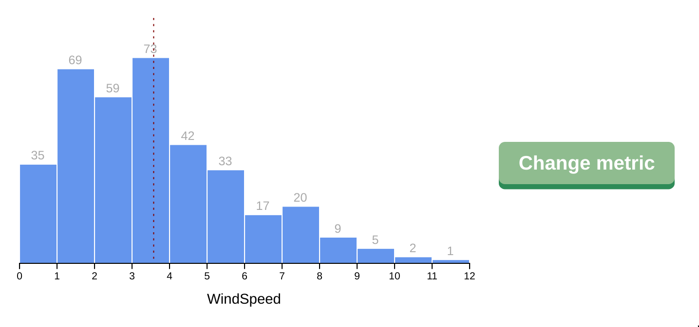

### CSS transition with a chart

In this example, the `index.html` is importing a CSS stylesheet (`styles.css`) and the `chart.js` file, which is an updated version of our histogram drawing code from **Module 3**.

<CodeSandboxEmbed
  src="//codesandbox.io/s/mdbsl?fontsize=14&hidenavigation=1&theme=dark&autoresize=1&module=/chart.js"
  style={{width: '100%', height: '35em'}}
/>

The code should look mostly familiar, but you might notice a few changes. Don't worry about those changes at the moment — they're not important to our main mission.

Let's look inside that `styles.css` file. We can see that we have already set the basic styles for our bars (`.bin rect`), bar labels (`.bin text`), mean line (`.mean`), and x axis label (`.x-axis-label`).

Great! Now that we know the lay of the land, let's look at our example — we should see our histogram and a **Change metric** button.



When we click the button, our chart re-draws with the next metric, but the change is instantaneous.


Does this next metric have fewer bars than the previous one? Does our mean line move to the left or the right? These questions can be answered more easily if we transition gradually from one view to the other.

Let's add an animation whenever our bars update (`.bin rect`).

```css
.bin rect {
    fill: cornflowerblue;
    transition: all 1s ease-out;
}
```

A>Note that this CSS transition will currently only work in the Chrome browser. This is because Chrome is the only browser that has implemented the part of the [SVG 2 spec](https://www.w3.org/TR/SVG/styling.html#StylingUsingCSS) which allows `height` as a CSS property, letting us animate the transition.

Now when we update our metric, our bars shift slowly to one side while changing height — we can see that their `width`, `height`, `x`, and `y` values are animating. This may be fun to watch, but it doesn't really represent our mental model of bar charts. It would make more sense for the bars to change position instantaneously and animate any height differences. Let's only transition the `height` and `y` values.

```css
.bin rect {
    fill: cornflowerblue;
    transition: height 1s ease-out,
                     y 1s ease-out;
}
```

A>`ease-out` is a good starting point for CSS transitions — it starts quickly and slows down near the end of the animation to ease into the final value. It won't be ideal in every case, but it's generally a good choice.

That's better! Now we can see whether each bar is increasing or decreasing.


Our transitions are still looking a bit disjointed with our text changing position instantaneously. Let's try to animate our text position, too.

```css
.bin text {
    transition: y 1s ease-out;
}
```

Hmm, our text position is still not animating — it seems as if `y` isn't a transition-able property. Thankfully there is a workaround here — we can position the text using a CSS property instead of changing its `y` attribute.

Switching over to our `chart.js` file, let's position our bar labels using `translateY()`.

```javascript
    const barText = binGroups.select("text")
        .attr("x", d => xScale(d.x0) + (xScale(d.x1) - xScale(d.x0)) / 2)
        .attr("y", 0)
        .style("transform", d => `translateY(${
          yScale(yAccessor(d)) - 5
        }px)`)
        .text(d => yAccessor(d) || "")
```

A>Note that we're filling our `<text>` elements with empty strings instead of `0` (with `.text(d => yAccessor(d) || "")`) to prevent labeling empty bars.

We'll also need to change the transition property to target `transform`.

```css
.bin text {
    transition: transform 1s ease-out;
}
```

Now our bar labels are animating with our bars. Perfect!

Let's make one last change - we want our dashed mean line to animate when it moves left or right. We could try to `transition` changes to `x1` and `x2`, but those aren't CSS properties, they're SVG attributes. Let's position the line's horizontal position with the `transform` property.

```javascript
const meanLine = bounds.selectAll(".mean")
    .attr("y1", -20)
    .attr("y2", dimensions.boundedHeight)
    .style("transform", `translateX(${xScale(mean)}px)`)
```

We'll also add the `transition` CSS property in our `styles.css` file:

```css
.mean {
    stroke: maroon;
    stroke-dasharray: 2px 4px;
    transition: transform 1s ease-out;
}
```

These updates are looking great!

There are some animations that aren't possible with CSS transitions. For example, transitioning the x axis changes would help us see if the values for our new metric have increased or decreased. Using a CSS transition won't help here — CSS has no way of knowing whether a tick mark with the text `10` is larger than a tick mark with the text `100`. Let's bring out the heavier cavalry.

### Final code for this lesson

<CodeSandboxEmbed
  src="//codesandbox.io/s/byrxo?fontsize=14&hidenavigation=1&theme=dark&autoresize=1&module=/chart.js"
  style={{width: '100%', height: '35em'}}
/>