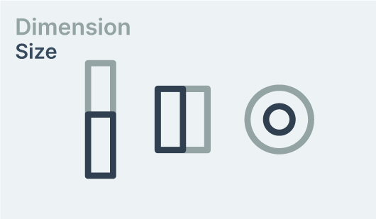
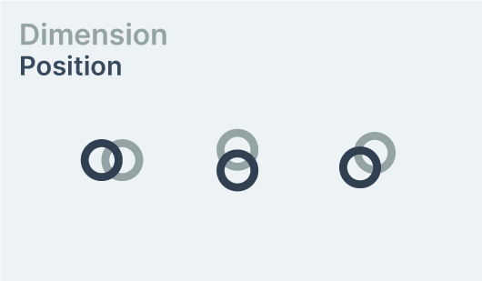
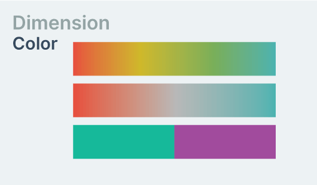

# Ways to visualize a metric

Now that we understand the metrics that we're working with, we need to decide how to represent them visually. Keep in mind that we, as humans, are able to judge some dimensions more quickly or precisely than others.

Let's go through some possible ways we could represent **temperature**, as an example.

### Size

{width=70%}

We could represent **temperature** by sizing an element: larger for higher temperatures and smaller for lower temperatures. We could also scale just the height or the width — when making our histograms, we created taller bars for higher numbers.

Humans are very fast and precise at perceiving size differences (especially height or width) between objects, making it a good choice when the exact differences matter.

### Position

{width=70%}

We could represent **temperature** by moving an element: horizontally, vertically, even diagonally. For example, we could make a scatter plot with lower temperatures to the left and higher temperatures to the right.

Like size, humans are very fast and precise at comparing horizontal and vertical positions, making it a great choice when precision matters.

### Color

{width=70%}

We could represent **temperature** by giving our elements a different color. For example, we could make a scatter plot with dots colored from blue (lower temperatures) to red (higher temperatures). Choosing colors can be overwhelming — don't worry, we have a section to help with just that coming up in this Chapter.

Humans are less adept at distinguishing two colors than distinguishing two sizes or two positions. However, we can more easily average colors together, making color a good choice for visualizations where the overall picture matters. If both the specific values and the overall picture are important, try showing the overall picture and progressively surfacing exact values with tooltips or a companion table.

There are other dimensions (for example, **orientation** or **pattern**), but these basic ones will get you thinking on the right path. These dimensions might remind you of a concept we've been using: **scales**. **Scales** have been helping us translate data values into a physical dimension: for example, **temperature** into **height of a bar  in pixels**.

A>When you have a dataset that is chock full of metrics like our weather data, it often isn't ideal to visualize all of it in one chart. Focused charts are the most effective — sticking with 2-4 dimensions will help the user focus on what's important without being overwhelmed.

# Putting it together

It can be tempting to jump right in and say "Oh I know, I'm going to make a bar chart!" But let's investigate further: what is a bar chart made out of? A bar chart is made up of **bars** that vary in size (**height**) and are spread our horizontally (**position**).

There is a whole world of chart types that haven't yet been created! Now that you have this framework, you'll be able to look at a dataset and brainstorm unique ways to visualize it.
