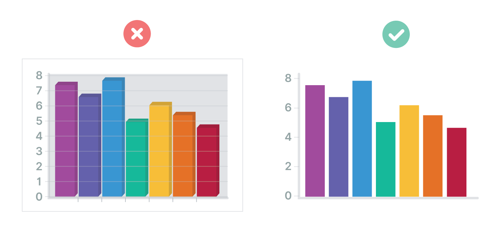
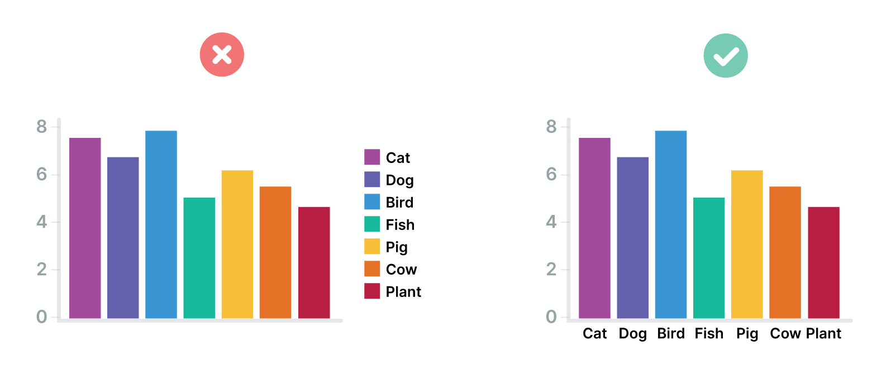
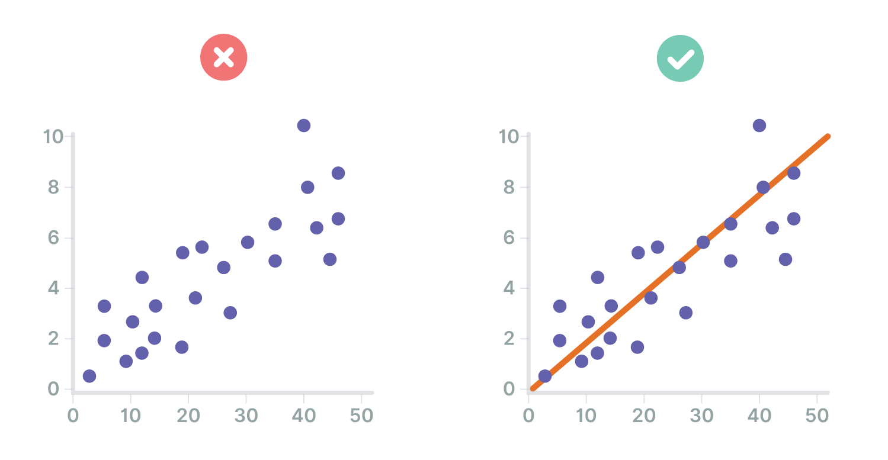

# Chart design

Now that you understand these basics, you have the tools you need to make effective and intuitive charts. Once you've decided on the what and the how, here are some tips for keeping those charts easy to read.

### Simplify, simplify, simplify

Many chart libraries will include default styles in order to satisfy as many use cases as possible. This can create charts with more elements than are necessary. Fortunately, we don't need to rely on a library and can strip away as much as possible.

After you finish creating a chart, give it a critical look and ask yourself, "Is everything on here necessary?" If the answer is no, remove the cruft! No need to overwhelm your reader.

### Annotate in-place

It can be tempting to throw a legend next to a chart to clarify a color or size scale. While we should make sure to explain every part of our chart, ask yourself if you can label these elements directly. In-place annotations put the description as close as possible, which prevents forcing the reader to look back and forth between elements.

### Add enhancements, but not too many

As a corollary to the last two tips, check to see if you can enhance your chart to help create insights. For example, if the goal of your chart is to show trends, consider adding a trend or reference line to make any patterns more apparent.

