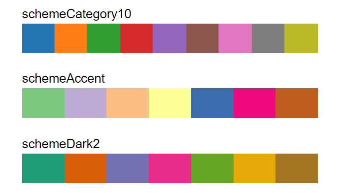
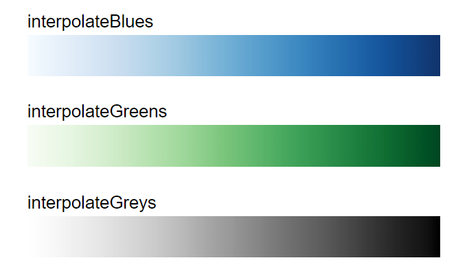
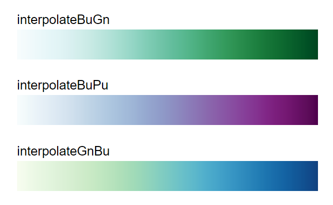
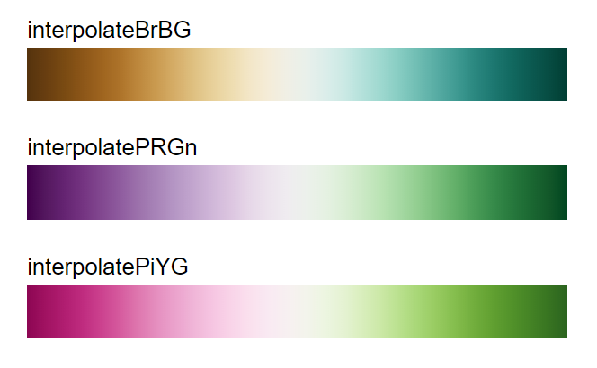

# Colors

One of the hardest parts of creating charts is choosing colors. The wrong colors can make a chart unappealing, ineffective, and, worst of all, impossible to read. This section will give you a good framework for choosing colors, important facts about human perception, and simple tips.

# Color scales

When choosing a color scale, you first want to identify its purpose. Going back to what we know about data types, there are three basic use cases:

1. Representing a category
2. Representing a continuous metric
3. Representing a diverging metric

<CodeSandboxEmbed
  src="//codesandbox.io/s/e27br?fontsize=14&hidenavigation=1&theme=dark&autoresize=1&module=/index.html"
  style={{width: '100%', height: '35em'}}
/>

Let's dive deeper into each of these.

### 1. Representing a category

The first two data types we talked about (**binary** and **nominal**) will be best represented with a categorical color scheme.

Since our metric values don't have a natural order, we don't want to use a color scheme that has a natural order (like white to black).

d3 has built-in color schemes in its [**d3-scale-chromatic**](https://github.com/d3/d3-scale-chromatic) library.

These **categorical** color schemes have been carefully designed to have enough contrast between colors. Each of these schemes is an array of colors — for example, to use the first scale in this list, we would access each color at its index in `d3.schemeCategory10`.

A>For **categorical** color schemes, it's helpful for each color to have a different descriptive name. For example, there might be two colors that could be described as "blue", which can be confusing to talk about.

#### 2. Representing a continuous metric

For metrics that are **continuous**, we'll want a way to interpolate in between color values. For example, we could represent **humidity** values with a color scale ranging from white to dark blue.

[**d3-scale-chromatic**](https://github.com/d3/d3-scale-chromatic)'s built-in continuous scales are visible under the **Sequential** section.

These are color scales instead of color schemes — `d3.interpolateBlues()` is a function instead of an array of colors. To get a color, we can give `d3.interpolateBlues()` a decimal in between `0` and `1` — `0` would return the leftmost color (a light gray) and `1` would give us the dark blue on the right. To put it in familiar terms, `d3.interpolateBlues()` is a scale with a domain of `[0,1]` and a range of `[light gray, dark blue]`.

These single-hue scales a great for basic charts and charts with multiple color scales. However, sometimes the steps in between color values are too small and it becomes hard to distinguish between values. In this case, **d3-scale-chromatic** has many **sequential** color scales that cycle through another hue, increasing the difference between values.

We can see how much easier it is to tell the difference between colors 50% and 60% of the way through a single-hue scale (left) versus a multi-hue scale (right).

We also have a few cyclical color scales, which are great for metrics whose values "wrap around". For example, if we wanted to represent the time of year, we could use a cyclical color scale that has no natural beginning or end.

#### 3. Representing a diverging metric

Our **sequential** color scales get more visually clear as they approach the end of the scale. This is great to highlight values on the high end (for example, the highest **humidity** values will be the most visible).

Sometimes, however, we want to highlight both the lowest _and_ highest metric values. For example, if we're looking at **temperature**, we might want to highlight the coldest days as a bright blue and the hottest days as a bright red.

**Diverging** scales start and end with very saturated/dark color and run through a less intense middle range.

We can see that we have both single-hue (per side) and multi-hue diverging scales. Again, it's helpful to cycle through more hues so users can pick up on smaller differences between metrics, but it can get overwhelming when we are already cycling through two hues. When getting a feel for color scales, try a few different options to get an idea for what will work in your specific scenario. This is not a one-size-fits-all decision.
