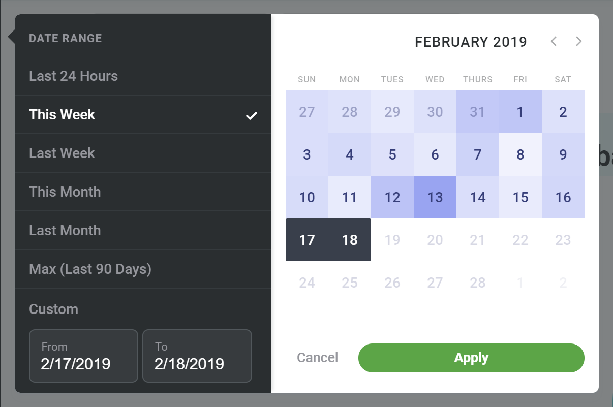

# D3 + Javascript Frameworks

We know how to make individual charts, but you might ask: what's the best way to draw a chart within my current JavaScript framework? D3 can be viewed as a utility library, but **it's also used to manipulate the DOM**, which means that there is a fair bit of overlap in functionality between a JavaScript framework like React and d3 — let's talk about the best way to handle that overlap.

First off, we should decide **when** to use d3. Should we use d3 to render a whole page?

Let's split up d3's functionality by concern:

1. DOM manipulation (like jQuery)
2. Data manipulation (manipulation, interpolation, basic stats)

With the library compartmentalized in this way, you might come up with unorthodox ways to utilize d3. For example, I recently used it to create a calendar date picker.

This date picker doesn't look like a chart, but d3 came in handy in a few ways.

- **d3-date** helps with splitting up a date range into weeks
- **d3-date** helps with calculating date range defaults — for example, if a user selects **Last Week**, the date picker will use d3.timeWeek.floor() and d3.timeWeek.ceil() to find the start and end of the week.
- **d3-scale** helps with creating a color scale to show data values between each day. This helps users know which days to select based on the data (in this case, online attention to a specific topic).
- **d3-time-format** helps to display each day's day of the month and the input values on the bottom left.
- **d3-selection** helps create mouse events to select days on hover when a user has selected their start date and will select their end date.

A d3 novice might not think to utilize d3 in this way, but once you get through this course, you will be familiar enough to take full advantage of the d3 library.

# Our game plan

There are many javascript frameworks out there that are used to build complex web applications. The basic principles of combining d3 with a framework apply to all of them: we'll cover those principles with a specific example (React.js). If you use React, great! If not, follow along anyway and learn the general principles - we run through a few other examples near the end (Angular.js & Svelte.js) to show how these principles can be generalized.
